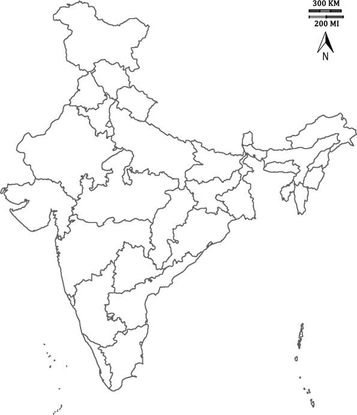

# Desi Map Hunt

A fun little Python game where you guess all 28 states of India on a blank map!
Inspired by the classic US States game in the Python 100 Days of Code Bootcamp.



## How It Works

* A map of India is displayed.
* You’re prompted to guess the name of a state.
* If correct, the name appears at its location on the map.
* If you type `Exit`, the game ends and saves the unguessed states in a `StatesToLearn.csv` file.

## Files

* `main.py` → The game logic
* `28_States.csv` → Contains all state names and their `(x, y)` positions on the map
* `Map.gif` → India’s blank map used for gameplay

## Things I Learnt

* Working with the `turtle` graphics module
* Using `pandas` to handle data
* Basic game logic and user input handling
* Creating educational mini games with Python

## Features

* Case-insensitive guessing
* Saves unguessed states for later revision
* Minimal clean UI using `turtle`

## Requirements

* Python 3.x
* `pandas` module (install via `pip install pandas`)

## How to Run

1. Clone the repo or download it.
2. Make sure `Map.gif` and `28_States.csv` are in the same directory as `main.py`.
3. Run the game:

```bash
python main.py
```

## 👨‍💻 Author

Made by Azaan Ahmed
🔗 [LinkedIn](https://www.linkedin.com/in/azaan-ahmed-a738b4332) |  [GitHub](https://github.com/NomadBeetle)
